Foundry VTT game setup and notes for the referee 
Foundry version : 12  
modules used ( v12 compatible ):  
levels   
wall height  
monks active tile triggers  
monks token bar ( used to lock / unlock tokens before / after teleport from scene to scene )
twodsix https://foundryvtt.com/packages/twodsix/
tile sort https://foundryvtt.com/packages/tile-sort

## terminology and abbreviations
/dir = directory folder followed by the folder name e.g. /dir playerHandouts  
adventure pdf = the shadows adventure 

## Use of AI 
AI has been used to generate the profile images for actors and some of the tile images
https://deepai.org/styles  
https://deepai.org/machine-learning-model/space-world-generator  
https://deepai.org/machine-learning-model/fantasy-character-generator  
https://deepai.org/machine-learning-model/alien-civilization-generator  

ChatGPT has been used for the statues on the pyramid exterior 

https://tacticaltokens.com/token-creator/ has been used to generate tokens from the images

## Foundry macro useful links 
V12 API references  
https://foundryvtt.com/api/v12/classes/client.Token.html#document
https://foundryvtt.com/api/v12/classes/client.TokenDocument.html ( used to )  
https://foundryvtt.com/api/v12/classes/client.TokenDocument.html#update
https://foundryvtt.com/api/classes/client.TokenConfig.html ( used to )  
https://foundryvtt.com/api/v12/classes/client.Tile.html ( the inherited update method is used in the macro to toggle the tile visibility )

NOTE press F12 in FoundryVTT to open the console for debugging as the scripts have console.logs statements. 

# setup game TODO list for the referee
1. Setup a world folder in Foundry and copy in the folder. Install the listed modules through the Foundry UI. configure Foundry core settings > open permission configuration ( for example if players can create / run macros, open doors etc ).
Delete ( or move outside of world folder ) any unused / unwanted sub folders from custom-assetts. For example, unused tokens, as both male and female were provided for each character. Also the macros folder is not used by Foundry but I have left this folder in as it is easier to read the macros from this directory with a code editor such as visual studio code, vs trying to read the macros in the Foundry UI macro dialog UI editor.   

2. Decide on which Traveller ruleset to use and configure the twodsix module. NOTE actors for both the players and the animals must also be configured to align with the chosen ruleset. for example if using CL where animals have only hits 

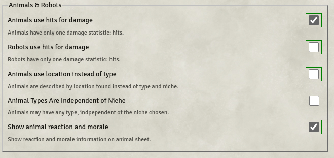

Note the animal hits ( heart icon ) on the animal stat block in format # / #. I think this is for  CT number of hits until unconcious / total number of hits until dead or for e.g. CD stamina / lifeblood. In play testing combat it seems this displays max / current hits. see notes for [a note on combat](#a-note-on-combat)  

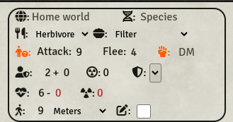

Note when manually setting up animal actors drag both the attack type ( e.g. teeth ) and the melee skill from the compendium. The attack type is configured to use melee skill otherwise when clicking to roll attack a UI notification will be shown with a message that no skill has been selected for the attack type.

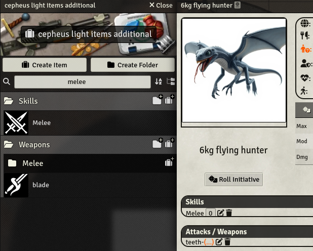

3. Assign ownership of the selected actor/s to players and configure each actors token vision settings to None. token vision none also applies to a player that controls 2 or more tokens as player may have 1 token at elevation 0m and another token at elevation 3.5m in the ventilation shafts.
drag and drop and configure the animals as 

4. Using player/s tokens as the referee test out the teleport tiles ( e.g. teleport from lvl0 > lvl1 > lvl1.4 > lvl2 ). Test out the door and light macros.  

5. Place animals on the scenes for fixed encounters as described in the adventure.pdf. Note animals can be also be set to invisible so that these can be revealed only to players when required. 

6. Using player and animal tokens as the referee run a combat encounter.   

7. Place player tokens on lvl0 at the steps to lower platform

8. Either use the macros or manually configure doors open/close and lights on/off 

9. Add player handouts as journal entries. some examples  
the large images of the animals which can be shown to players when first encountered to assist in describing the animals to the players
3D artwork / images showing the pyramid complex 

10. optionally setup a landing page 

## Foundry folder structure 
https://foundryvtt.com/article/media/  
https://foundryvtt.com/article/user-data/  

## Foundry world size ( and notes on using compendiums )
TODO - start to optimise the world to reduce size and move data into compendiums 
https://foundryvtt.com/article/compendium/
https://forums.forge-vtt.com/t/world-size-check/12105 ( even if not using Forge the same logic applies )

## importing world into Foundry 
https://blog.forge-vtt.com/

## configure twodsixmodule 
Refer the twodsix wiki ( https://github.com/xdy/twodsix-foundryvtt/wiki ) for instructions on how to configure the module for the ruleset the referee chooses to use e.g. CT , CE SRD, CL, CD 

## sharing handouts with players 
I suggest from the adventure pdf use print to file ( as pdf ) the single page for the aerial view of the pyramids. The pdf can be imported into gimp and exported as a webp.

in the /dir playerHandsouts 

Setup in Foundry VTT Journal entry folder - e.g. named player handouts
pages  

0. aerial view
1. amphibian grazer
2. chaser
3. flying hunter
4. ( other graphics ? a sketch of the powerplant control room ? )

# Scenes in Foundry VTT 
scenes have been renamed from those used in the adventure pdf 

| name in adventure pdf | name in Foundry VTT | NOTE |
| --------------------- | ------------------- |------|
| exterior | lvl0 | |
| interior |  lvl1 | |
| fault in the shaft ( location 14) | lvl1.4 | an additional webp of the shaft without the fault has been included but not setup as a scene. the referee can setup a scene using this webp to model any point in the shaft where players are descending or ascending and there is an random encounter with flying hunters. The referee can optionally include this scene in the sequence of player token teleports up or down the shaft or manually move player tokens to / from this scene. Players on the pendulum cable likely would not be able to use weapons as both hands required to hold onto the cable. Players being lowered by cable by other players from above likely would still be able to shoot / use weapons but this could result in swinging motion - apply -ve DM's to attack rolls etc. It is left up to the referee to determine if players are attacked by flying hunters in the shafts. |
| power plant | lvl1.5 | |
| deep level | lvl2 | |

## scene map grid scale 
1.5m per grid square. Grid size in pixels is 140. This is set in the scene configuration settings. All webp files exported from dungeondraft are at 140dpi.   

NOTE for lvl0 the image exported at 140 has then been scaled down by 50 in gimp as a lossy with 90% to reduce file size. ( 35mb vs 7mb). The image quality is not as sharp as the other lvl images.  
 
## use of levels module  
lvl1, lvl1.5 and lvl2 are setup to use the levels module to so that players can move through the ventilation shafts. 

| level name ( within the scene) | height range | notes |
| --------------------- | ------------------- | ------------------- |
| lvl1 | 0 to 3m | e.g. lvl1_background.webp| 
| lvl1vents |  3 to 7.5m | 1 and 2  e.g. lvl1_transparency.webp|  
  
1. The vents in the ceiling, as shown in cross section diagram in the adventure pdf, have been measured on the diagram as 3.5m ( i.e. the base of the vent is 3.5m above the floor. the vent height and width is 1.5m. )
2. The maximum height of domed large chambers, as shown in cross section diagram in the adventure pdf, has been measured on the diagram as 7.5m.

The vents level is a single tile set to the same size as the background. The tile image uses transparency for 'holes' so that tokens / players have visibility to the chambers the vents open into.
The entry / exit points to the vents are set up as overhead tiles ( relative to the floor lvl ) so that these are visible to tokens / players from the ground level ( these tiles are setup to fade when the players token is under the tile ).

NOTE when I designed the vents level in dungeondraft I used objects ( the pipe images ) to model the vents - not walls. So there was no point in exporting the vents level as a VTT file for import into FoundryVTT. The the walls manually added in FoundryVTT. 

The referee has to manual elevate tokens to either 0m or 3.5m to reflect the change in elevation. i.e. unlike tutorials for the levels module showing stairs or elevators or ladders can be setup so that when tokens are moved onto these the token is automatically elevated to the higher level - in this case there is no corresponding mechanism i.e the referee is going to have to rule on how a player will be able to enter the vent e.g. 2 other players help boost the player up - or the players have a piece of equipment from the ships locker that facilitates climbing ? 

NOTE when the referee (manually) changes the player tokens elevation to the higher (3.5m) or lower (0m) level the UI notification error message 'levels the attempted movement collides with at least one floor / cieling' is displayed.  
The referee and players can ignore this message ( TODO research if it is possible to turn a setting on/off in Foundry to supress this message ) 
 
## a NOTE on using monks active tiles with levels
NOTE. to connect lvl1 and lvl1.5 tiles have been setup on e.g. lvl1 and lvl1vents to teleport tokens to the corresponding tile on lvl1.5 and lvl1.5vents. When testing this I noted that if the tiles on e.g. lvl1 and lvl1vents overlap as placed on the scene map despite being set at different elevations, monks active tile triggers module has no reference to the levels module, so when a teleport acion is setup on overlapping tiles, ALL tokens within the tiles, regardless of level / elevation are teleported. 
I also noted that a token with elevation set to 3.5 that was teleported using a tile set at 3m on vents level ( 3m so as to be underfoot of the token at 3.5m ) when the token is teleported the tokens elevation is changed to 3m. The resolution to this was to add an additional action on the tile to set the tokens elevation before the teleport action. 
TODO consider changing the tile elevation to 3.5m and retest.   
NOTE the only tiles to teleport between scenes on the vents level is between lvl1 and lvl1.5. 

## tokens and shared vision 
NOTE. in Foundry be default ( e.g. when logging in as a player ) the players token is selected and the players vision is restricted only to the players token. if for e.g. player1 and player2 actors ownership is configured so that the player1 is owner and player2 has observer permission 
THEN 
when player1 deselects the token ( e.g. by click one of the other menu options such as measurement controls ) this changes the UI view to also player2 and player2's vision ( and areas revealed from fog of war by player2's exploration )
when player reselects the players token ( left click on token ) this resets the players vision restricted only to the players token.

NOTE there is a configurable option in Foundry VTT core settings to deselect a token using left click. This is off by default ( I suggest the referee not enable this )

NOTE shared vision does not work when using the levels module. For simplicity the referee should disable shared vision on all levels ( else the referee has enable shared vision
for lvl0 an disable when entering the pyramid through lvl1 or lvl1.5 ).
See https://foundryvtt.com/packages/SharedVision as an option to be able to toggle shared vision on / off when switch between exterior and interior scenes 

To manually disable token shared vision edit confiugure the player ownership settings 

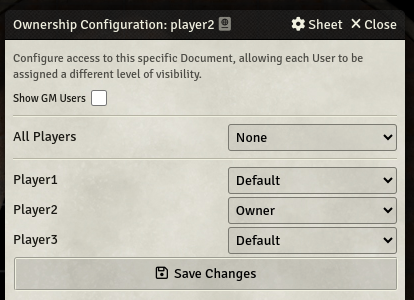

Either set all players to None as the default, or set each player 1x1 to None for all other players. 

Shared vision for tokens on the same level within a scene works. The issue is when a token is for e.g. elevated 3.5m to the higher (vents) level and that token moves and fog of war reveals areas of the map at the higher (vents) level - the tokens still on the lower level see the shared vision as if that token on higher level had moved through the areas on the lower ( ground ) level that correspond vertically to the areas on the higher (vents) level. This is an unwanted side effect as this can reveal areas on the lower level the tokens have not explored.

NOTE - be sure to test the players vision by logging in as the player into a browser. As the referee, in foundry VTT app, can behave differently, for example, in the original ventilation system I designed on lvl1, a vent pipe crossed over the large chamber  ( location 9 ). When I then used the levels module to add the vent level
above the floor level, in the Foundry VTT app, a token on floor could see the path traced by a token that went through pipe on vent level, but in the browser logged in as the player, this was not seen. I suspect this could have been an issue with the pipe on vent lvl running through the 'transparency' hole in vent lvl title above location 9  
Regardless I then changed then changed the design of the ventilation system so that none of the ventilation pipes was laid out over an area of transparency with the benefit that I could then place walls more easily on the vent level if there was some buffer of pure black either side of the pipe. 

see also  
https://www.reddit.com/r/FoundryVTT/comments/y9zzhv/shared_vision_showing_tokens_within_vision/
https://www.reddit.com/r/FoundryVTT/comments/189c1ax/allow_players_to_use_the_levels_layer_tool_with/

## scene lights configuration
lvl1, lvl1.5 and lvl2 are setup to use lights. The lights are all 'placed' on the 'ground' level in the scene. To stop these lights being seen by tokens in the vents ( for example where a vent runs parallel above a lighted corridor ) - edit each light - under basic settings - light top elevation ( ground level is 0 to 3 ) to anything less than 3. e.g. 2.5m.

The lights in the chambers can be visible from the ventilation level ( the heights of these chambers are > 3m ) edit each light - under basic settings - light top 7.5m
configure the scene - lighting tab - uncheck levels don't disable lights ( note this had no effect anyway until i set the individual light height )

TODO. also consider writing a macro so that some lights are set to 'flicker' Foundry does not have an inbuilt animation setting on the light itself for 'flicker' e.g. it does have pulse, so a custom macro running on a loop to turn light on/off with a time interval in between

## visually simulating open / closed doors 
Foundry door trigger has been setup to switch images ( showing open / closed states ) on a tile under the door. 

NOTE - I did consider using a single image to show the door closed and hide this tile when the door is open but I was unable to get the visual result I wanted in the FoundryVTT UI, was the hidden tile was still visible but with some level of opacity, vs using 2 images and switch between images.

TODO - retest the single tile usage in the browser as seen by player vs FoundryVTT UI. 

## macro to randomly set the state of the doors open / close at the start of the adventure
As per the adventure pdf - Note the large curved doors, suspended on magnetic fields. For each, throw 9+ for the door to be in the open porltion. 

A macro, gameStartSetDoorStateOpenOnLvl1AndLvl2onRollOf9+, can be used by the referee to set the state of the doors at the start of the adventure. The macro has been written to change only those doors on lvl1 and lvl2.   

NOTE - whilst the macro works, it was noted in testing, that an error is thrown for doors that are not on the currently open scene, when the macro is run :

Error: Error thrown in hooked function '' for hook 'updateTile'. Cannot read properties of null (reading 'document')
[Detected 2 packages: levels(5.3.14), monks-active-tiles(12.02)]

The issue I believe is linked to game.MonksActiveTiles.triggerTile(tileUuid); 

So for e.g. if the macro is run when lvl1 is currently viewd, doors that are opened / closed on lvl2 the Foundry console ( press F12 to see the console before running the macro ) shows the errors. Also the sound for the door opened / closed does not play.

The doors / and under door tiles, despite the error, are correctly in synch. 

The referee has 2 options. 
1. run the single macro to set the doors on both lvl1 and lvl2 and ignore the error in console.
2. run the alternate macro's 1x1 when the current view is lvl1 or lvl2  

| macro | run when view lvl |  
|--------|-------|
| lvl1GameStartSetDoorStateOpenOnRollOf9+ | 1 |  
| lvl2GameStartSetDoorStateOpenOnRollOf9+ | 2 |  

## macro to randomly open / close doors for seismic tremor events on the animal encounter table 
As per the adventure pdf - In the event of a seismic tremor, any doors may change position on 7+ unless already propped open

Closed doors may beopened by brute strength, applying 13+ in strength characteristic, and then propping the door open with a bar, tool, or weapon

Logic suggests that anything that is not fixed in place ( think in terms of Old School Dnd where iron spikes were used in dungeons ) can be shaken loose by a seimsic tremor. The referee can rule on what measures are sufficient for a door to be propped open that withstands a seismic tremor. For e.g. if the players in order to rappel down the shafts have bought a long a drill with eye bolts the same drill and eyebolts can be used to fix doors in the open position. 

A macro setFlagUsingUIDialog can be used by the referee to set a flag on a door with the key doorProppedOpen ( note case sensitive ) and value, for which any text e.g. 1 , true, can be input, and clicking confirm on the dialog. The flag can be unset / removed by the same macro leaving the value field empty. The door UUID can be copied by clicking on wall controls and then clicking on the door to open the wall dialog and then single click the copy document UUID icon.  

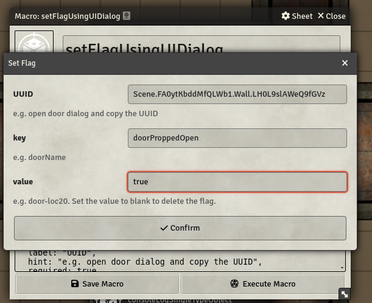

NOTE A macro consoleLogSingleTypeObject can be edited using the same UUID as setFlagUsingUIDialog to display the Object in the console ( F12 to display the console ). The objects properties can be inspected ( click the small arrow icon to expand ) and the flag / value that was set should be visible as one of the world flags.   

A macro closeOpenDoorsOnLvl1andLvl2OnRollOf7+ can be used by the referee to simulate the change in door state in the event of a seismic tremor. 

NOTE - this when this macro is run the console shows the same Error thrown in hooked function '' for hook 'updateTile' .

The referee has 2 options. 
1. run the single macro to close open doors on both lvl1 and lvl2 and ignore the error in console.
2. run the alternate macro's 1x1 when the current view is lvl1 or lvl2  

| macro | run when view lvl |  
|--------|-------|
| lvl1closeOpenDoorsOnRollOf7+ | 1 |  
| lvl2closeOpenDoorsOnRollOf7+ | 2 |  

## macro to randomly toggle lights on / off 
NOTE to expand upon the animal encounter table die roll of 3 seismic tremor : The complex begins to shake. A macro has been setup to randomly toggle lights on / off with a % chance ( the % chance can be changed by editing the macro ). This was not in the original adventure pdf. The
referee can also choose to run this macro at any time other than a seismic event.  

A macro toggleLightsOnLvl1AndLvl15AndLvl2AtRandomChance can be used by the referee to randomly toggle the lights

This macro has been tested and no errors are thrown in console. 

The referee has 2 options. 
1. run the single macro to randomly toggle the lights
2. run the alternate macro's 1x1 when the current view is lvl1 or lvl1.5 or lvl2  

| macro | run when view lvl |
| --------------------- | ------------------- | 
| lvl1ToggleLightsAtRandomChance | 1 |
| lvl15ToggleLightsAtRandomChance | 1.5 |
| lvl2ToggleLightsAtRandomChance | 2 |

## a note on tile image opening / closing secret doors using monks active tiles to switch tile images.
NOTE - a bug has been raised on secret door changing tile image not working properly in v12 https://github.com/ironmonk88/monks-active-tiles/issues/828  

The tile image switch works the 1st time when opening the secret door. Clicking on the door after the first click results in the tile images that are out of synchronization with the door state. Continued clicks on the door return both the door and tile synchronization to the original state. NOTE that players will see ( and hear ) the multiple door clicks if the referee wants to close the open door.  

The other option to work round this issue is to setup the door how to the secret door in the curved wall of the chamber lvl1 location 13 has been setup where the tile ( manually triggered ) actions is to change the door state and switch the tile image ( i.e. basically the reverse of a door trigger - in this case the tile is triggering the change in the door state - not the change in door state triggering the change in the tile ). A play sound action could also be added but this only plays one sound ( not 2 for open / closed ). TODO research writing a macro to play a sound when the door changes state - and check the state changing from / to.  

## location detail tiles 
When I was drawing the maps for the interior levels of the pyramid (starting with lvl1) at the time I did not include all the details of the locations as stated in the adventure pdf for e.g.on lvl1 the fungi in locations 4 6 8. By the time I was drawing lvl2 I started to consider adding in the details of the locations in the adventure pdf and added some of these these for e.g. the partially collapsed chamber on lvl2 location 20 but did not add others for e.g. the skeletons on the floor on lvl2 location 15. i.e. how much detail is enough, and the detail is also dependent on having the right dungeondraft assetts to model the location descriptions for e.g. lvl0 the statue figures, I have no dd assetts for statues other than angels or greek temples.
By the time I was exporting VTT maps from dungeondraft to import into Foundry VTT I started to regret the inconsistency in details between lvl1 and lvl2 and was putting this onto the TODO list to go back and rework the maps in dungeondraft to then re-export at least the webp files to replace the webp files in Foundry ( the battlemap importer module converts VTT file to a webp ) so as not to re-import the VTT file ( into a new scene ) and redo all the work done to configure lights walls etc - I then realised that I could half fix the issue by using tile images with the details.
TODO - rework maps in dungeondraft. Provide 2 options. 1st plain chambers and export plain tiles people could then add their own assetts onto so that the adventure could be customised - as many of the locations in the adventure pdf - the chambers are empty. 2nd put in all the details and don't use any location detail tiles with no option to customise. 

This is the reason why, for e.g, on lvl1 there are tiles with fungi. I was experimenting with the 1st option to see if this concept could be used successfully in Foundry. The fungi tiles are static / display only. There are no actions / triggers.
The same logic applies to lvl0 the statues, The referee can swap out the images on the tiles for e.g. using statues of reptilians might give away too much to the players who will see these images and expect to find reptilians in the pyramid interior. 

### tile naming conventions
I used three (3) naming conventions for tiles so that when using the FoundryVTT module tile sort the names in the list of tiles are logical 

1st ( used by door and floor detail tiles )
lvl<lvl#>-<optional-descriptor>-<loc#>-<descriptor> 
the optional descriptor is used for some tiles for e.g. the pyramid exterior secret door through the pyramid steps, lvl0-entry-to-lvl1-loc1-door-open-detail, as this tile is re-used on both lvl0 and lvl1 

2nd ( used for the ventilation tiles as these numbers do not always align with the location numbers  )
lvl<lvl#>-<descriptor>-<number> 
NOTE in each overhead-ventilation-files dir there is a webp file e.g. lvl1-overhead-tiles-by-number-keyed-map. I have included this file so that 
the referee can use it to help identify the tiles on the vent levels ( some locations have 3 tiles A, B, C). This file is not served to players by Foundry so it can be deleted to save some disk space.  

3rd ( used for Teleport tiles  )
teleport-from-lvl1-loc9-to-lvl2-loc21
teleport-from-lvl0-loc3-to-lvl1-loc1-secret-door 
teleport-vents-from-lvl1.5-loc26-to-lvl1-loc25 ( the only teleport between scenes on the vents level is between lvl1 and lvl1.5 )  

NOTE some tiles are setup as both teleport and landing tiles. In this case the teleport from and to naming convention takes precedence over the teleport-landing naming convention. 

NOTE some teleport tiles also use an image to show location detail. In this case the tile name uses the teleport-from prefix but the webp file uses the 1st naming convention.

teleport-landing-from-lvl1-loc1
NOTE some tiles are setup only as the destination for a teleport, i.e. these tiles have no trigger actions configured to teleport from these tiles. In this case the tile name uses the teleport-landing prefix but the to-.... part of the tile name is.  

lvl# is the level number   
loc# is a number, where possible, that aligns with the location numbers in the adventure pdf  
descriptor e.g. door-tiles, floor-tiles, overhead-tiles  

# how to stack multiple tokens per hex
? eg the encounter tables list qty of animals encountered ( in one case 24 amphibian grazers / snakes ). Small animals ( 1kg ) in large numbers it is highly likely that there will be multiple animals on the same grid square. 

Note tokens can be placed on the same grid square. The issue is then how to cycle between those tokens, for example, in combat, to move one of the tokens. 

Foundry out of the box has the option on the token HUD to send to back - this can be used to cycle through multiple tokens in the same grid square. 

https://www.reddit.com/r/FoundryVTT/comments/1d9tcbx/token_stacking_module/ < not for v12 
https://foundryvtt.com/packages/token-z

## scene darkness levels
exterior lvl0. configure > lighting tab > darkness level set to max 0 ( more visible) 
interior levels. configure > lighting tab > darkness level set to max 1. This darkens the interior so it dimly lit but it also helps darken the very thin 'walls' laid down over the pipes that stick out into the rooms 

NOTE - check the view in the browser as the player. for e.g. the wall overlay in foundry is semi transparent but when viewed logged in as a player in browser it is solid dark black 

## changing scenes lvl0 to lvl1 to lvl1.4 to lvl2 
NOTE one the reason for using monks active tiles and not regions ( v12 Foundry) for teleport. The reason is the tile can be right clicked and manual activated with the token on the tile whereas the region would have to be disabled - then enabled before moving the token onto it. ( or setup a trigger tile with an up or down arrow icon ).

NOTE lvl1 and lvl1.4 uses 2 icons with text to explain which icon to click on to teleport characters back up to lvl1 or down to lvl2. For the 
click to teleport to function select the tile menu option then select the token menu option - this deselects any selected tokens. Now double click icons to teleport.
TODO consider applying the up icon to lvl2 rather than manual right click on tile HUD to trigger the tile.  

NOTE when changing from lvl0 to lvl1 players will be descending using a cable. I have not set any elevation change on the tokens as part of the tile trigger action. The height elevation is relevant if the players as per the adventure pdf - Descending this shaft will require
cable, and a swinging motion once down. [refer lvl1 loc 1](#lvl1-location-1-descending-using-cable-from-lvl0-and-swinging-onto-the-walkway-surrounding-the-shaft)

To teleport token from lvl1 to lvl2 ( and vice versa) the referee manual activates the tiles when the tokens are over the tile. The tiles been set up at the shaft locations on both levels which teleport the token/s to the corresponding tile on the other level ( e.g. location 9 on lvl1 to location 21 on lvl 2 and vice versa ).
When a players token is teleported the players view will automatically be pulled to the scene the token is teleported to ( e.g. from lvl1 to lvl2 ). The scene teleported to is NOT the active scene. 
To stop players exploring by moving the token it is reccommend the referee LOCK the token from movement BEFORE activating the tile to teleport the token/s. ( use monks token bar or a custom macro ) so that the referee can control which scene to handle play on ( i.e. only 1 scene is active at a time )

## locking unlocking tokens ( for e.g. when shifting scenes )
options. 
1. custom macro. 
2. use monks token bar. note this only shows icons controlled by the players. it doesnt show referee controlled characters even if those tokens are set to disposition friendly the so there is no need to lock those referee controlled characters.

# pre-generated players / actors converted
The 8 pre generated characters in the original adventure have been ( loosely ) converted to CL in terms of skills assigned from the skills compendium in the Foundry twodsix module.

The actors are in the players dir under Foundry actors tab. The referee should let players choose ( or assign ) these actors to players. 
The default equipment listed per character, as per adventure pdf, has been added to the actors inventory tab from the items in the CL compendium pack that is included with the Foundry twodsix module.

Should the referee chose to use another ruleset e.g. CE SRD this conversion work has to be redone.

## a NOTE on animal stats
I manually configured the stats for the amphibian grazers / chasers / flying hunters ( refer actors tab / animals folder). The cepheus compendiums have no monsters. I manually mapped the damage and the attack type, armor rating etc in line with the encounters table. for example the chaser - teeth 3d6 damage.  
NOTE even if selecting CL as the ruleset in the twodsix module configuration the monster stats still display the animal as having the same 6 stats as players which is how CE SRD manages animals. Skills does not apply to CL animals. 

## a NOTE on players equipment / encumbrance
A custom compendium 'cepheus light items additional' has been setup so as not to edit / change the twodsix cepheus light items compendium . i.e.
if you unlock the cepheus light compendium to edit you are presented with a UI dialog warning that changes to this compendium may be lost if the sytem that owns this compendium is updated ( i.e. twodsix updates ) 

see also the separate md file CT_to_CL_conversion_notes_and_other_considerations 

## a NOTE on vacc suit damage rules 
CL CD and SE SRD do not have rules for vacc suit damage. 
Players which sustain damage from animal attacks ( teeth ) then the attack type has compromised the vacc suit integrity. i.e. the suit is punctured ( vs claws resulting in slashed / gashed open vacc suit ) 

As per the original adventure pdf - players handout - ships locker 
Vacc Suits, each with oxygen tanks for eight hours

As per the original adventure pdf loss of vacc suit integrity results in instant exposure to the insidious atmosphere which is corrosive and unbreathable - thus a loss of vacc suit integrity would result in death, from lack of breathable oxygen, not instantly, but within rounds / minutes as the vacc suit loses oxygen and the additional damage resulting from the exposure to the atmosphere.
This is the reason I suggest the referee revise the atmosphere from insidious, corrosive to exotic - standard irritant. 

NOTE I have designed these rules from the original vacc suit damage rules see https://www.travellerrpg.com/threads/vacc-suit-damage-rules.14675/  
I suggest the referee use common sense or use these rules as a guideline. 

For simplicity - assume that for each animal attack that results in damage this requires 1 patch. Thus 6 hits on a player requires 6 patches. 

### vacc suit patches 
Standard equipment on a vacc suit is a suit patch--included with the suit's emergency kit. It typically takes one combat round to ready the patch from the suit's kit and one round to apply the patch (30 seconds total) with regards to punctures. Gashes require one round to ready the patch and two rounds to apply the patch.

Suits typically come equipped with 1D patches in the emergency kit, depending on manufacturer, suit type, and the character's foresightedness.

Applying the patch to a puncture requires a 6+ throw. Applying the patch to a gash requires a 8+ throw. In either case, use Vacc Suit skill as a DM. On a failure, a 2D check 8+ throw + DM's for DEX is made to determine if the patch is ruined. If successful, the attempt to apply the patch can be made again the following round. If the DEX check fails, then the procedure begins again with the character taking time (and maybe suffering damage) to ready and apply a new patch.

Time for readying and applying a patch can be halved if a second person helps. It does take two hands to apply a patch. The player must also be stationary. i.e. patches cannot be applied in combat. 

Once a patch is applied, the referee should secretly roll on the Patch Quality Table below. For punctures, roll 1D -2 (minimum of 1). For gashes, roll 1D.

|Patch Quality Table|
|-------------------|
|1.  Patch will last indefinitely.|
|2.  Patch will last 1D -2 hours.|
|3.  Patch will last 4D minutes.|
|4.  Patch will last 3D minutes.|
|5.  Patch will last 2D minutes.|
|6.  Patch will last 1D minutes.|

It is left up to the referee to determine that a gash in the vacc suit is so large that it cannot be patched. For random determination of this event, it is suggested that 1D is thrown, with the result of a "6" indicating that the damaged section of the vacc suit cannot be patched. ~~Refer to the air leak/vacuum exposure rules.~~

For simplicity I have not included the rules regarding helmet damage. i.e. damage to the helmet / visor which unlike the suit portion of the vacc suit is not a soft shell but rigid, such as a cracked visor etc, most likely cannot be repaired, at which point the player, in order to survive, must attempt to return to the scout ship before exposure to the atmosphere results in death. The same logic applies once a player has run out of patches.  

A suit that is not patched results in exposure to the atmosphere.
see notes for [damage from exposure to atmosphere](#a-note-on-damage-from-exposure-to-atmosphere)
The loss of vacc suit integrity also increases the rate at which the oxygen reserves are depleted. 

### damage to vacc suit PLSS ( portable life support system)
see notes for [falling as a result of a seismic tremor](#a-note-on-damage-from-falling)

see also Vacc Suits in pg. 47 of JTAS-9.

I suggest the referee use common sense or apply these rules with regards to damage to players vacc suit PLSS. i.e. my intent is that the player is penalised through the effects of damage to the PLSSS but not to such an extent that the player cannot play on or at least try to return to the scout ship ( the scout ship may have a reserve vacc suit in the ships locker ). 

Random damage to vacc suit PLSS. Roll 1D6

|  Suit system fault     | effect |
|-------------------| -------------------|
|1.  Oxygen regulator  | (A) |
|2.  Oyxgen reserve  | (B) |
|3.  Temperature regulator| (C) |
|4.  Pressure loss | (D)|
|5.  Lights | (E) |
|6.  Communicator | (F) |

NOTES  
(A) loss of air supply. e.g. a fault in the air regulator. player receives suffers -DM ( 1D6/2 )for strenous tasks due to lack of oxygen.    
(B) loss of air reserve due to a leak. the system is self sealing but the player has lost 1D6 hours of oxygen reserve. The player may receive oxygen from an external source e.g. other players vacc suit system through use of an umbilical oxygen cable ( It is left up to the referee to determine if the players have bought with them the umbilical oxygen cable or if this has been left in the ships locker ) 
(C) The vacc suit temperature increases or decreases 1 degree per minute until the internal temperature equalizes with the temperature of the surrounding external environment. As per the adventure pdf - 

Temperature is remarkably constant within the complex, staying at a steady 20 degrees C at chest height. However, this temperature varies with height within the chambers. Near the ceiling, it rises to 25 or even 30 degrees; near the floor, it reaches 10 degrees.

Refer the CL CD CE SRD rule sets for extreme temperatures. -10 to +40 results in no damage but the referee can apply other effects for e.g. the temperature decreasing / increasing within the suit causes the helmet visor to fog up reducing visibility. ( 1D6 / 3 -DM in combat )

(D) As per Vacc Suits in pg. 47 of JTAS-9. 

Vacc suits may be pressurized to thin, standard, or dense levels. If the suit's interior pressure is higher than the exterior pressure, the suit has positive pressure. It its pressure is equal to the exterior, it has equal pressure, and if its pressure is lower than the exterior, the suit has negative pressure.

The wearer of a suit pressurized to negative or equal difference suffers no negative DMs due to pressure.

If, for example, you are in a contaminated area (biological, chemical, radiological, etc.(,it is advisable to positively pressurize your suit by at least one level. That way, if you puncture your suit the gas pressure within it will help to keep the contaminated material out. The same
applies for tainted, corrosive or insidious atmospheres.

For simplicity assume players vacc suits are pressurised to equal pressure. Loss of pressure results in -2DM to apply vacc suit patches.
Loss of pressure also doubles the rate at which players exposed to the atmosphere ( i.e. double damage effects for the same time intervals or halve the time intervals ) for e.g. if the players suit is not patched after damage sustained in combat and the suit has a pressure loss system fault. 

(E) edit the player token settings and reduce the dim / bright light radius. set both to 0 for no lights.   
(F) the suits short range communicator is broken. players can no longer communicate by radio. players must use hand signals or some alternate communication method. ( lip reading through the helmet visor ? )

see also the separate md file CT_to_CL_conversion_notes_and_other_considerations 

## a NOTE on damage from falling 
CL/ CD / CE SRD A character suffers 1D damage per 2m fallen, up to 6D at terminal velocity. Multiply this damage by the world’s gravity rating in Gs.  
For simplicity assume gravity rating is 1. 
A fall from a cable even in the bottom 3rd of the cable descent ( the shafts is ~100m deep) is a 30m fall which is easily the maximum 6D ( 6D = 2x6 = 12 metres ).
If the player does not die instantly then throw for vacc suit damage / loss of integrity and resulting damage from expsoure to the atmosphere. If the player is not unconcious it is up to the referee to determine if the character is incapacitated and if the vacc suit can be patched ( or not ).

The other possibility of falling, from a standing position, is from a seismic tremor. as per the adventure pdf 

Throw two dice for the strength of a tremor: any individual with a dexterity less than the throw is shaken to the floor or ground by the force of the tremor. Throw endurance or less to avoid 1D bruises from the fall; DM minus vacc suit skill and brawling skill. Throw 11+ to lose vacc suit integrity; DM + vacc suit skill.

I suggest the referee use the 2D6 of the seismic tremor to determine the target number for players to roll over to not loose balance and fall from the seismic tremor. DM's + vacc suit skill. + Dexterity DMs. + Melee Combat ( which brawling in CT maps to in CL ).  
 
The throw under endurance can be replaced with throw 6+. DM's + Endurance DM.  
I also suggest the referee reduce the damage from the fall be reduced from 1D6 to 1D6 / 3 ( i.e. max 2 damage ) as it is likely with recurring tremors there is a high chance of multiple falls. ( and the players also risk damage from combat with animals )  
Or the referee only apply damage from tremors of strength 10+.  

I also suggest the referee rule out loss of vacc suit integrity and perhaps replace this with some sort of damage to the vacc suit system ( e.g. lights, or air supply leak reducing vacc suit operating time, or temperature control ) that can be applied as an ongoing effect on the player. 

I suggest the referee replace Throw 11+ to lose vacc suit integrity; DM + vacc suit skill. with throw 2D6. a natural throw of 12 ( regardless of vacc suit skill ) results in damage to the vacc suit PLSS. 

## a NOTE on damage from exposure to atmosphere 
If the referee choses to modify the atmosphere from insidious, corrosive to exotic - standard irritant so that players exposed to the irritant atmosphere as a result of a fall, or animal attack, which compromises vacc suit inegrity, results in sickness, -DMs that accumulate, or loss of END, over time, vs instant death from an insidious atmosphere.

The description of the modified atmosphere :

In gaseous content, the interior atmosphere is similar to that on the world surface. The atmosphere is comprised of low levels of of sulfur dioxide , nitrogen and other halogens. However, vents and passages constantly keep the atmosphere in circulation. In most cases, the atmosphere is transparent, but close to floors, in depressions, and under the metal corridor platforms, it has condensed to a ~~pinkish~~ white ( which is also consistent with the vapor drawn on the dungeondraft maps at the vent shaft entrances ).
vapor, opaque to visible and infrared light. This vapor can also be seen wafting down from ceiling vents, and accumulating to a depth of about ten centimeters. When (and if) analyzed, the atmosphere tester light glows red.

The sulfur dioxide and chlorine components of the atmosphere will result in irritation to the players lungs and eyes and / or skin.  

Initially irritation of the eyes, nose and throat are the dominant symptoms. With further exposure, nausea and vomitting ensue, with the eventual onset of permanent eye damage, pulmonary oedema, laryngeal spasm and respiratory arrest.

Sulfur Dioxide: ( source https://wwwn.cdc.gov/TSP/MMG/MMGDetails.aspx?mmgid=249&toxid=46 )
Exposures of 50 to 100 ppm may be tolerated for more than 30 to 60 minutes, but higher or longer exposures can cause death from airway obstruction. Sulfur dioxide is heavier than air; thus, exposure in poorly ventilated, enclosed, or low-lying areas can result in asphyxiation.

Chlorine: ( sources https://en.wikipedia.org/wiki/Chlorine_gas_poisoning / https://www.cdc.gov/niosh/ershdb/emergencyresponsecard_29750024.html)

For previously healthy individuals with an acute exposure to chlorine, pulmonary function usually returns to pre-exposure levels within 7 to 14 days. Individuals who survive a single, acute exposure usually have no long-term adverse health effects, although persistent effects have been reported. For example, exposure to chlorine may cause reactive airways dysfunction syndrome (RADS), a chemical irritant-induced type of asthma.

Toxicity to chlorine gas depends on the dose and duration of exposure.  At concentrations of 1 to 3 ppm, chlorine gas acts as an eye and oral mucous membrane irritant; at 15 ppm, there is an onset of pulmonary symptoms, and it can be fatal at 430 ppm within 30 minutes.

The effects of sulfur dioxide and chlorine are similar. 

NOTE this table is only suggestive. It is left up to the referee to determine how toxic the atmosphere is. i.e. increase the expsoure time and / or reduce the effects.  

NOTE if the players vacc suit integrity is compromised the resulting pressure loss also doubles the rate at which players exposed to the atmosphere ( i.e. double damage effects for the same time intervals or halve the time intervals ) for e.g. if the players suit is not patched after damage sustained in combat and the suit has a pressure loss system fault.

|  exposure time ( minutes)      | effect ( describe to the players )|
|-------------------| -------------------|
| 0 -5 ( initial exposure ) | (A) |
| 5 -15  | (B) |
| 15-30  | (C) |
| 30-45  | (D) |
| 45-60  | (E) |
| > 60  | Death |

(A) players can smell the sulfur and/or chlorine and can begin to instantly feel irritation to eyes, nose, throat.  
(B) players are struggling to breathe similar to asthma -2DM on all throws. 1D6 hits ( starting with endurance ).  
(C) players are coughing and vision is affected to struggle to breathe. -4DM on all throws. additional 1D6 hits. base movement is halved.  
(D) physical extertion is hard to sustain. -6DM on all throws. apply appicable rules for exhaustion. climbing cables unassisted is impossible. base movement reduced to 1 square. additional 1D6 hits.  
(E) players can no longer move unassisted. players will require other players to drag or carry them. e.g. 1 player to carry throw 10+ +DMs for STR, 2 players to carry, throw 6+ cummulative DM's for STR. additional 1D6 hits.    

see also the separate md file CT_to_CL_conversion_notes_and_other_considerations 
see also https://wiki.travellerrpg.com/Tainted_Atmosphere
see also https://www.freelancetraveller.com/features/science/atmos/atmo4.html

# base movement vs maximum movement
Traveller ( CT, CE SRD, CL CD ) use concept of base speed and speed multiplier.
NOTE base movement depends on which version of the Traveller ruleset is used for e.g. CE SRD 6m = 4 grid squares, CL 9m = 6 grid squares.

refer CT, personal combat

> Characters may move one band per combat round if walking or two if running;
The CT speed tables (1983) lists running(triple) running(quadruple) - with note - running at faster than double speed is generally impossible for long period but the rules do not provide any further information on this statement ( it is left up to the referee to implement ? )

CE SRD - ( is a contradictory mess ).  
In a combat round each character gets a minor action and a significant action.  
You can perform a single significant action per round, or forego it to perform a total of three minor actions.
A character can take two minor actions instead of a significant action. 
( so which is it ? 2 or 3 ? if it is 3 then this is triple speed ( sprint?) max distance in round is 18m ) 

CL - Each character has two actions in their turn. List of actions includes, move up to 9m. A character can use 2 actions to move twice i.e. double move i.e running. 
CD - Same as CL but 10m not 9m

I suggest the referee allow base speed ( walk) , double speed (run), and choose to rule if triple speed ( sprint?) is possible. 

NOTE characters in a vacc suit, as per the common sense in the CT rules, require a task check to perform a maneuver.  
refer CT rules. 

> A basic throw of 10+ to avoid a dangerous situation applies whenever any non-ordinary maneuver is attempted while wearing a vacc suit (including running, jumping, hiding, jumping untethered from one ship t o another, or other such activity).

I suggest the referee reduce characters base speed in a vacc suit base to 3m not 6m to reflect the difficulty of running in a vacc suit. 

see also https://www.reddit.com/r/traveller/comments/1hg2x76/classic_traveller_animal_encounter_table_animal/

# a NOTE on combat 
as the referee select all combattants right click one of them and toggle the combat state - note all combattants are added to the combat tracker
roll initiative for each combattant in the combat tracker 
example of simple 1 on 1 combat 
for e.g. the the player with highest initative targets an animal. left click the player token. right click the animal to target and select the target in the token HUD.
NOTE deselect any currently selected targets from the previous combattants turn AND then select the targets for the current combattants turn.

right click the animal and on the HUD select the tareget icon.    
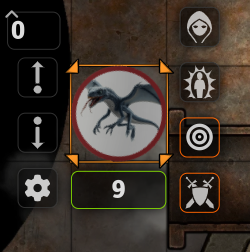

open the players character sheet ( or assign the weapon as a shortcut on the players macro hotbar) and roll to attack using the players weapon.  
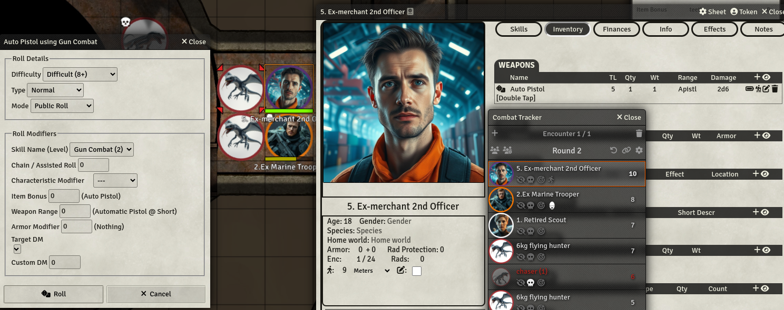

NOTE the DM's to the attack roll. Some of these need to be manually applied ( e.g target is obscured etc ). I suggest both the players and referee double check these against the ruleset in use ( e.g. armor modifier applies to the attack roll is a CT rule and optional rule in CE). Also double check how the twodsix module has been configured.  
These DM's can also be seen in the chat message log after the attack roll has been rolled by expanding the roll.  

If the attack roll is successful the damage window is displayed. The deal damage button applies the damage.   
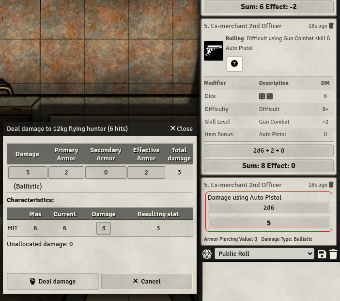

If the damage is more than the targets current hits the dialog the target is dead and the referee can manually apply the effect to the token and / or remove the combattant from the combat tracker ( right click for dead target in the list of combattants to see menu options )  
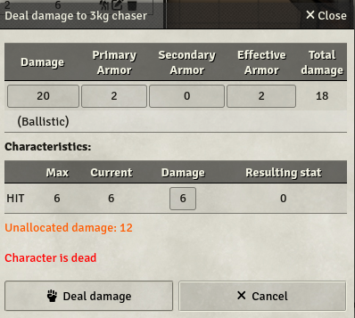

In this example of 3 hits on a flying hunter the damage is reflected in the animals stats sheet.  
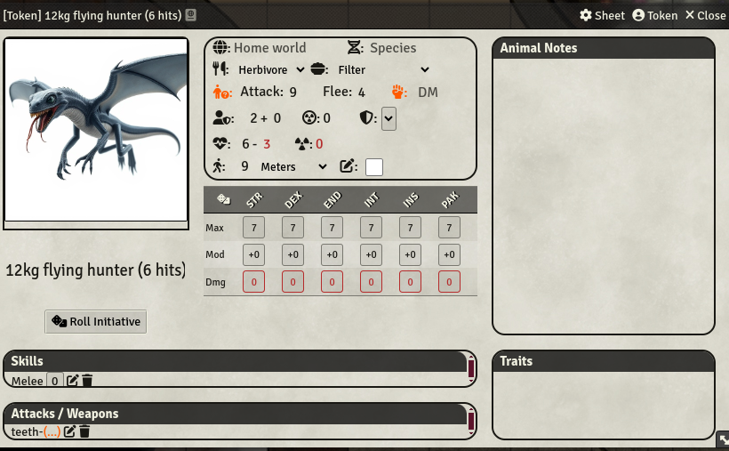

NOTE that for weapons such as a shotgun that also applies damage to players / animals adjacent to the target ( 2D6 vs 4D6 ) the referee can manually roll using the roll formula in the chat message ( e.g. /roll 2d6 ) and manually apply damage. NOTE When using the shotgun and selecting a target a template is also drawn on the scene to show scatter damage ( this should either be a circle template or any square adjacent to the target including diagonal )  

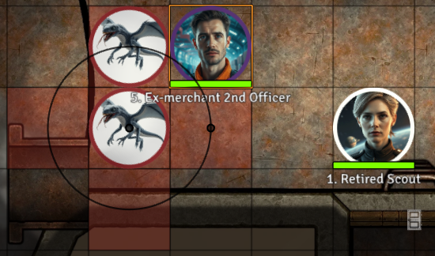

The alternative option for the referee, is to use the combat tracker for initiative and to track which player animals turn it is in the turn order but the referee can manually use roll formulas in the chat message to roll for attacks and apply damage.  

# lvl0 / exterior specific notes 

## a NOTE on players vision when starting the adventure on lvl0 
lvl0 scene configuration - lighting tab - the token vision checkbox has been unchecked. This allows the entire scene to be visible to players.

the player characters in the actors tab vision has been pre-configured 
vision tab - basic configuration tab - vision mode set to basic vision
vision tab - detection modes tab - light perception range set to 10m 

NOTE - I did setup macros that change player tokens lightPerception range dependent on or specific levels by name but realised this was too complex and redundant for the purposes of this adventure. It is simpler to configure the scene token vision and Foundry then imposes the vision
restriction automatically bewteen interior and exterior levels without having to run macros or manually change token vision settings. 

~~Should the players open the secret door in corridor at location 1 on lvl1 to the exterior lvl0 I suggest using the tile to lock and teleport the tokens to the corresponding tile on lvl0 - and then reconfigure the players vision. The same applies should players exit the powerplant at location 32 on lvl1.5.~~ 

~~The reverse applies should the players then re-enter lvl1 or lvl1.5.~~ 

## starting location 
start the players in the lower right hand corner of the scene where the steps to the complex starts. players can zoom out and view all of the scene. The referee should have been provided players with a copy of the handout ( show journal entry ) from the adventure showing the 'aerial' view of the pyramid complex ( I suggest use print to file from the pdf and then add this to the game folder and setup a journal entry ) 

## tiles to model the closed / open door through on the steps of the pyramid 
Refer to [lvl1 location1 secret door notes ](#lvl1_location1._the_secret_door_that_exits_through_the_pyramid_steps_to_the_pyramid_exterior.) that  macro is run by the trigger action on the secret door in the corridor on lvl1 location1 that toggles the tile images on lvl0 to show the door in the in pyramid steps. These tile images open / closed are in synch with the secret door status on lvl1. DO NOT manually change the visibility of these tiles on lvl0.    

NOTE - these tiles were originally exported from dungeondraft at 140 dpi. Unlike the lvl0 scene background image which has been scaled down, these tiles have not been scale down. The reason is that these same tiles are also re-used on lvl1 which has not been scaled down. The tiles on lvl0 are only visible if the door on lvl1 location 1 is opened from the inside of the pyramid - the only issue, which is minor, is if the players notice the difference in the resolution between the tiles and the surrounding lvl0 scene background image. The same resolution difference also applies to the visible statues and the lvl0 scene backgroud image.

## tiles to model the closed / open shaft on the top of the pyramid 
as per the adventure pdf - The single fiqure atop the pyramid is constructed so as to pivot

3 tiles have been used to model the shaft entrance to lvl1 as per the adventure pdf. The 3rd tile which has no image is used only as landing tile when the trigger action on the statue tile is used to move the tile to the right to reveal the shaft entrance tile.  

To 'move' the seated figure statue to the right to reveal the shaft entrance to the players manually right click and activate the statue tile.

The referee can teleport players to lvl1 by manually activating the shaft entrance tile. NOTE the players elevation will not be changed. If the referee wants to model the players tokens as hanging from the cable after the teleport to lvl1 loc1 the referee can manually edit the players token elevation.  

# interior ( applies to all interior levels )

### a NOTE on players vision 
interior levels are configured to use token vision. Tokens are configured to use basic vision and lightPerception range 10 grid units. ( 10 x 1.5m = 150m) 

### a NOTE on the animal encounters
the adventure pdf lists only 1 animal encounter table. the animal encounter table DM's bias the probability of encounters with grazers / chasers / flyers depending
on location. 
the animal encounter table has no DM's for vents as a location. i.e. encounters in the vents was not considered, despite the description in the animal encounters of the adventure pdf 

> The interior of the pyramid complex is infested with a large number of animals, all of which have lived and bred within its walls for hundreds of years. They inhabit
the airshafts, the drainage vents, the small spaces beneath the magnetic flooring, and other likely areas such as the pools in large chambers.

> Note the magnetic platform floors. Such floors are similar to the platforms in the corridors, but span the full width of the small chambers, leaving a very small
gap (only a few centimeters) at the edges.

It can be rationalised that the smaller animals ( grazer, chaser ) access the the drain vents and spaces beneath the magnetic flooring through the gaps between the platform floors and the walls. If the referee chooses to use the gap description, as per the adventure pdf, (only a few centimeters), then logic suggests this gap is too narrow for even the smaller animals to pass through. Referring to the cross section diagrams of the corridors in the adventure pdf, the gaps. in proportion to the scale on the diagram, are 10 to 20cm. I suggest the referee change the gap description to 15cm as this then permits the rational logic that both the grazers ( largest is 3kg) can easily move through this gap. i.e. this can allow for suprise and cinematic cut scenes for e.g. 

> as you move down the corridor you see a group of what looks like serpents ( the grazers ) on the corridor platform. ( the referee rolls to determine if attack or flee and the results is flee ). the serpents then slither away down the corridor to either side where you see them dissapear down the gaps between the platfrom and the corridor walls 

> The Juveniles ( i.e. the grazers ) full size of 75 to 100 cm
> The male ( i.e. the chaser )reaches a maximum size of about 40 cm, weighing from 3 to 6 kg. ( 40cm seems very small )
> Females are usually about 60 cm in length, with a wingspan of 100 to 120 cm.
( ? so the animals shrink in length but develop more body mass as they mature ? I suggest the referee reconsider this so that the males are 60cm and the females are 80cm and scale up the wingspan to 160cm )

The referee can also rationalise that the 3kg ( and 6kg if the max size is 40cm ) chaser ( if the referee choses to use the redesigned reptilian chaser and flyers ), for its size, still has a flexible body, that can be contorted to move through this gap. 

It is difficult to rationalise that the larger animals ( 6kg and 12kg flyer ) can move through this gap. The flyers cannot be encountered in spaces under platforms ( e.g. if the players tilt a small chamber 2 platform as described in the adventure pdf )

> If a character manages to get below the floor, a set of animal lairs will become apparent; consult the encounter tables.

Reconsidering encounters in the vents, which are 3.5m above the chamber floors, the flyers have no issue in flying up to the vents ( and also flying in the vertifcal shafts between lvl1 and lvl2 ).  

The logic hole in the adventure pdf is there are no chambers on lvl2 with fungi to feed on then in order for animals to be on lvl2 the animals must move from lvl1 to lvl2. The flyers can fly down. The chasers could ( like the players ) leap to the pendum cable and crawl down. Grazers on lvl1 are isolated to lvl1. Grazers ( hatched on lvl2 by mating of flyers and chasers on lvl2 ) are isolated on lvl2 ( with no fungi to feed on ? ). I suggest the referee include in the description to the players of the pyramid interiors that there are crawling insects, similar to cockroaches, which the animals also feed on. What then, do the cockroaches feed on ? cockroaches feed on almost anything that is derived from something that was once a living organism, such as plants and animals, and also feces which can be then be used to rationalise as the reason why the pyramid interiors are not totally covered in animal droppings. 

To rationalise chasers on lvl2 I suggest the referee update the chasers and flyers description that similar to for e.g. climbing frogs / newts / salamanders. The chasers and the flyers, in addition to claws, have adhesive pads on their feet.  These pads are small, specialized structures on the undersides of their toes that secrete a sticky substance. The sticky substance acts as an adhesive, allowing the salamander to cling to surfaces such as glass or tree trunks. The adhesive pads provide extra grip and prevent the animals from slipping while climbing. this can allow for suprise and cinematic cut scenes for e.g. 

> you look up and spot a serpent like creature that has four legs that is on the curved wall of the domed chamber.. ( the creature then jumps at you or the creature stops, turns its head, opens it's mouth lined with sharp teeth, you see the flick of a tongue and tendrils that extend out of the mouth between the teeth, and then it crawls into the ventilation shaft and dissapears from sight ..  ) 

This can then be used to explain, chasers and flyers are able to access lvl2, grazers can be hatched on lvl2, and / or there exists a drainage and ventilation shaft system which be used by the animals to 'crawl' between the lvls. 

## animal encounter table 
Roll 8+ for an encounter to occur. +2DM if lights are out. 

If the players are in the corridors roll 1D on this table  

| die | qty | animal type | weight | hits | armor(protection rating) |  wounds & weapons CT values | wounds & weapons CL values | animal speed CL values(1) | reactions |  
| --------------------- | --------------------- | --------------------- | --------------------- | --------------------- | --------------------- |  --------------------- | --------------------- |  --------------------- | --------------------- |
|0 | 12| amphibian grazer | 1kg | 2/0 | none(0) | 3(0to10) teeth-1 ( -1 is DM to the combat roll NOT damage ) | 1(A) teeth| S1=9m(max)| F8 A5 S2 |  
|1 | 8| amphibian grazer | 2kg | 4/1 | jack(2) | 4(0to10)teeth-1 | 1(A) teeth | S1=9m(max)| F7 A5 S2 |  
|2 | 24| amphibian grazer | 3kg | 6/0 | jack(2) | 5(0to10) teeth+1 | 0to2(B) teeth | S1=9m(max) | F6 A5 S2 |  
|3 | | Seismic tremor: The complex begins to shake. Any open door will change its condition on throw of 7+  Optional. run macro closeOpenDoorsOnRollOf7Plus | | |
|4 | 4| chasers | 3kg | 2/5 | jack(2) | 4(0to10) claws | 0to2(B) teeth | S2=18m(max) | F8 A6 S3 | 
|5 | 12| chasers | 6kg | 5/3 | mesh(3) | 7(0to11) claws | 0to4 teeth | S2=18m(max) | F7 A9 S3 | 
|6 | 4| flying hunters | 6kg | 4/4 | jack(2) | 5(0to11) as blade | 0to4 teeth | S1/S3=27m(max) | F4 A9 S4 |   
|7 | 8| flying hunters | 12kg | 6/0 | jack(2) | 7(2to12) as blade | 0to10 teeth | S1/S3=27m(max) | F5 A8 S4 |  
|8 | 4| flying hunters | 12kg | 9/0 | jack(2) | 10(2to12) as blade | 0to10 teeth | S1/S3=27m(max) | F5 A5 S4 |  

Reactions  
Sn is the animals speed. 
NOTE in CT the combat round is 15 seconds. In CE SRD / CL the combat round is 6 seconds.   
S0 imobile, S1 ordinary speed, S2 double speed ( what is ordinary speed in CT ? )  
S2=2x9=18m in 6 seconds for the amphibian grazer ( snake ) imho sounds like too much speed so I did some research some snakes can move at max speed of 2.5m second x 6 seconds combat round = 15m.   
Chasers S2    
Flyers have 2 speeds, S1 if crawling, S3 if flying.  
DMs  are applied to this table depending on location within the pyramid complex.  
Vertical Shaft: +4. ( if roll a 1+4 =5 chaser, in vertical shaft ? either modify this to +5 or if a chaser iis encountered in the shaft it is crawling on the vertical walls )
Large Central Chamber: +2.   
Large Corridor: no DM.   
Large Chamber: -3.  
Small Chamber: -4.  
Small Corridor: -3.  
Power Plant Area: no DM.  

Notes    
(1) base speed in CL is 9m. revise these speeds if using for e.g. CE SRD base speed 6m. Note characters can run ( double speed ) S2. 
A the damage only on a natural roll of 12    
B the damage only on a natural roll of 12. roll 1d6 1-2 =0, 2-4=1, 5-6=2  
The wounds & weapons CT values column has been included only for purposes of comparison between the animals in the adventure pdf and the animals converted to CL to highlight the 1kg and 3kg animals in CT caused more damage than when converted to CL. 

If a seismic tremor is rolled the referee can (optional) run [macro](#macro-to-randomly-open--close-doors-for-seismic-tremor-events-on-the-animal-encounter-table) which is setup to toggle the door states. Note that if players, as per the adventure pdf, use something to stop the doors from closing, these doors marked doorsPoppedOpen using a macro to set the flag on the door, will not be closed by the macro.

The referee can also (optional) run [macro](#macro-to-randomly-toggle-lights-on--off) which is setup to toggle lights on / off at random. 

If the players are in the vents roll on this table  

| die | qty | animal type | weight | hits | armor(protection rating) |  wounds & weapons CT values | CL damage | CD damage using armor as DM to hit |reactions |  
| --------------------- | --------------------- | --------------------- | --------------------- | --------------------- | --------------------- |  --------------------- | --------------------- |  --------------------- | --------------------- | 
|3 | 4| chasers | 3kg | 2/5 | jack(2) | 4(0to10) claws | 0to2(B) teeth | | F8 A6 S3 | 
|4 | 12| chasers | 6kg | 5/3 | mesh(3) | 7(0to11) claws | 0to4 teeth | | F7 A9 S3 |    
|5 | 8| flying hunters | 12kg | 6/0 | jack(2) | 7(2to12) as blade | 0to10| 3to13 | F5 A8 S4 |  
|6 | 4| flying hunters | 12kg | 9/0 | jack(2) | 10(2to12) as blade | 0to10 | 3to13 |F5 A5 S4 |

Notes  
If the referee chooses NOT to use the option that the chasers can climb walls then ignore 3 and 4 on the die roll i.e. no encounter, and the only animal that can be encountered in the vents is the flyers. i.e. the chasers and grazers cannot access the vents and are assumed move only though the underfloor drain connections which the players wont be crawling into ( because i did not go to the effort to model this in dungeondraft ).

# lvl1 ( the interior )

## token vision pre-configured for when players enter the pyramid interior ( applies to all lvls expect for exterior) 
players enter the pyramid interior either using cables to descend the shaft, or through the power plant. The secret door at the end of the corridor in location1 that exists through the steps on the pyramid exterior not detectable from the exterior and can only be opened from the interior. It is left up to the referee to decide if the hidden entry can be opened from the exterior to facilitate the players entry to the interior. 

players vision has been pre-configured and is restricted on the interior levels to lightPerception range 10 grid units. 
players light has been pre-configured to these settings :

light tab - basic configuration 
light radius :
bright 2 grid units
dim 4 grid units

emission angle :
360 degrees. ( 360 for simplicity, if the referee wishes to realistically simulate forward facing lights within the players vacc suit then use a 100 degree emission angle. this then requires the players to then constantly rotate their tokens to direct the light source for the player tokens vision. this could also be used to model the tokens facing when resolving attacks from front / side / rear ) or rear )  

assume the light source is from the vacc suit itself. Note to perhaps add more stress and drama to the adevnture the referee potentially can rule that should an encouter roll result in a siesmic event and a player fail a task check and falls the the lights on the vacc suit have been damaged and reduce the light radius.  

## lvl1 location 1 descending using cable from lvl0 and swinging onto the walkway surrounding the shaft
as per the adventure pdf - Descending this shaft will require cable, and a swinging motion once down.

It is left up to the referee to determine the throw target number / difficulty rating for a player to swing onto the walkway surrounding the shaft. +DMs vacc suit skill. ( I suggest at least an 8+ )
Logic suggests players descending the shaft are secured to the cable using mountain climbing ring / D clips and the vacc suit has inbuilt tether connection points or the players have rigged a harness or securely tied the cable round the player similar to a lasoo so that the player is not holding onto the cable using only his / her hand grips strength. 
The player then has to start a back and forth swinging motion which will be made difficult by the upper entry shaft which the cable will rub against. The player then, at the right moment, has to have enough slack in the cable ( perhaps by radio comms to other players above if they are holding the cable to let some slide through their grip ), or detach from the cable, so that the player will not be pulled back off the walkway once the player has swung onto it by the inertia in the cable of the back and forth swinging motion started by the player.   
It is left up to the referee to determine if the players vacc suits has an inbuilt mechanism to shoot a tether cable with a grappling hook or some anchoring bolt, so the player does not have to swing but can pull him / her self onto the platform, although in the case of a grappling hook there is nothing to grapple onto unless the referee rules that location 2 which is reached by climbing up a set of raised stair rungs and that rungs, implies, rungs like on a ladder, as opposed to recessed steps.  

## lvl1 location 1. the secret door that exits through the pyramid steps to the pyramid exterior. 
3 tiles have been setup for the visual effects to simulate the door open close 
1st tile - has 2 images for the door open and closed
2nd tile - is a large tile copy of a section of the bottom 3rd row pyramid steps and forecourt. This tile shows the middle of the bottom row of the steps has been moved down ( i.e. towards the base of the scene ). 
3rd tile - is placed on top of the 2nd tile - where the middle steps would have been 

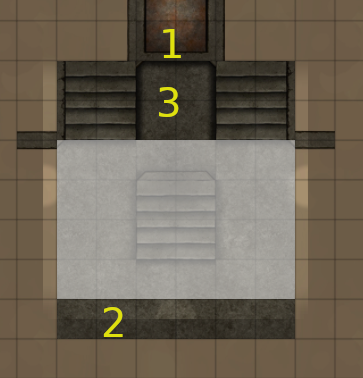

2nd and 3rd tile are toggle visible / not visible depending on the secret door 

NOTE the bug ( https://github.com/ironmonk88/monks-active-tiles/issues/828) ) on monks active tile triggers is not affecting the additional trigger to run macro on the tile but the secret door still has to be clicked on 2 or 3 times before the macro will run in synch with the door image changing from closed to open.   

NOTE opening the secret door also runs a macro that changes the visibility of tiles on lvl0 to show the open entrance through the pyramid steps. If the players move through the secret door on lvl1 a small section of the pyramid steps ( tiles 1 2 3) has been modelled. The referee can teleport players to lvl0 by manually activating the invisible ( shown as white ) tile 

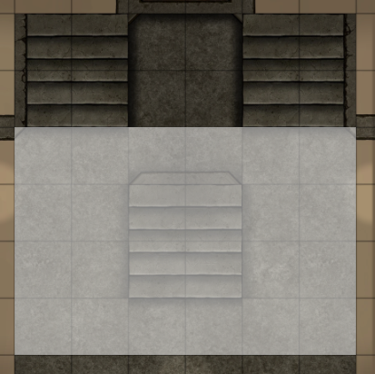

## lvl1 the vent visible at the fault in the corridor at location 5
Visible at the horizontal fault are the upper vent and lower drain pipe. 

If players are inside the vent note that the the broken pipe in the corridor is offset. As a result of placing the walls the gap is too narrow for a token to move through the broken section of pipe and so the referee should inform players the reason why the tokens cannot move is the gap is too narrow and / or impossible to move through without a tear in the players vacc suit due to the jagged metal. There is a small 'transparency hole' so that players can see some of the corridor below the vent. 

## lvl1 location 3 & 5 
From the adventure pdf, The upper area is filled with boxes mada of pressed board, all now empty
These details have not been added to the base image ( ~~TODO~~ should I add location detail tile for the boxes ? no not worth the effort. players will likely see empty room and exit. as the referee you can verbally tell them you see some boxes made out of what appears to be pressed board )

## lvl1 location 13. the secret door 
secret door was setup correctly ( in curved wall just need to add multiple triggers to toggle each section of the curved wall. when you import the vtt it will set this
section as wall. click each section and change it secret door. when setup up trigger on the tile - you need to have a change door action trigger on each section of
secret door - and also another action to switch tile images so that it shows the wall removed)
~~TODO~~. add a sound file to play to highlight the door has opened / closed. Sound has been added as tigger action but note the sound is the same for both door open / close ( unlike for e.g. secret doors which have 2 sound files one for open one for close ) 

## location 4 6 8
locations detail tiles for the fungi. These tiles are static / display only. 

# lvl1.4 - the fault in the shaft 
NOTE in the adventure pdf location 14 is listed with other locations on the deep level 
The fault in the shaft, as shown in cross section diagram in the adventure pdf, as measured on the diagram at a depth of (approximately) 41 to 51m. Total shaft depth from the lip on the rim on lvl1 to the floor on lvl2 as measured on the diagram, 105m.  

# lvl1.5 ( the power plant )

## lvl1.5 location 32
The entrances with the protective metal bars, as per the adventure pdf, if the players cut through the metal bars, the players can enter the power plant, the metal bars have been drawn on the scene background image. Each entrance a has a secret door that has been setup with a door trigger to trigger the tile under the door and the trigger action runs a macro that changes the hidden state of the tile from true to false. 
The referee should only click once on the door ( i.e. once the players cut through the metal bars, there is no reversing the procedure ).

# lvl2 ( the deep level )

## location 21 the pendulum 
the pendulum has not been modelled in Foundry. TODO a static tile or token could be setup to move in a preprogrammed pattern ? there were some promising modules but these were for Foundry v9 or v10 not for V12.

